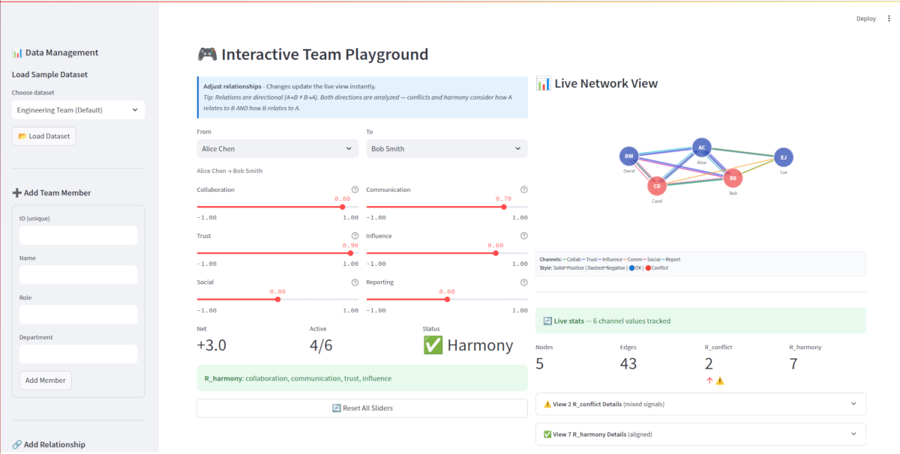
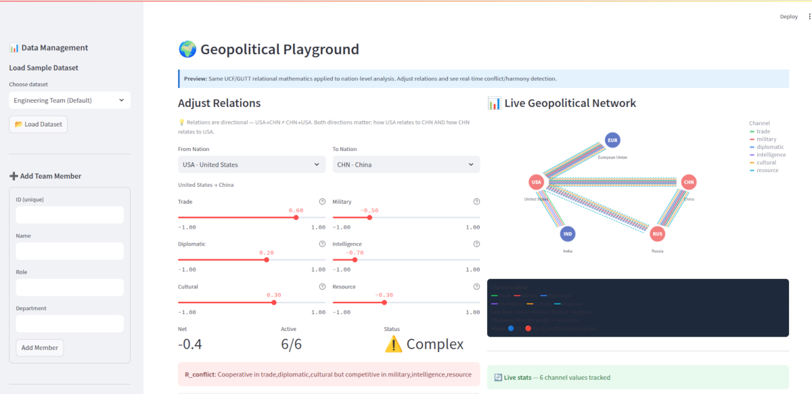

# UCF/GUTT Organizational Network Analysis - DEMO VERSION

## ⚠️ IMPORTANT: This is a Demonstration Version

This software is provided for **evaluation purposes only**. It uses **simplified algorithms** to illustrate the concepts of UCF/GUTT relational analysis without exposing proprietary methods.

---

## What is UCF/GUTT ONA?

**Organizational Network Analysis (ONA)** powered by UCF/GUTT applies relational tensor theory to understand team dynamics. Unlike traditional approaches that focus on individuals, UCF/GUTT treats **relations as primary** — entities emerge from their connections.

### The Core Insight

Every workplace relationship has multiple dimensions:
- Alice *collaborates* well with Bob (+0.8)
- But Alice *trusts* Bob less (-0.3)
- While Bob *influences* Carol strongly (+0.9)

**R_conflict** occurs when these channels send mixed signals — collaboration is positive but trust is negative. This predicts friction even when surface-level interactions seem fine.

**R_harmony** occurs when channels align — all positive or all negative. These relationships are stable and predictable.

### Why It Matters

| Traditional ONA | UCF/GUTT ONA |
|-----------------|--------------|
| Single "relationship strength" | 6 independent channels |
| Binary: connected or not | Weighted: -1.0 to +1.0 |
| Static snapshots | Directional: A→B ≠ B→A |
| Descriptive only | Predictive (production version) |

---

## Screenshots

### Network Visualization

*Multi-channel network graph showing team relationships with conflict/harmony detection*

### Team Playground

*Interactive playground — adjust relationship weights and see real-time impact on network health*

### Geopolitical Playground

*Apply relational analysis to international relations with 6 diplomatic channels*

---

## Use Cases

**HR & People Analytics**
- Identify hidden conflicts before they escalate
- Map informal influence networks
- Onboarding: understand who connects to whom

**Team Health Assessment**
- Quantify collaboration patterns
- Detect silos and bottlenecks
- Track relationship evolution over time (production)

**M&A Integration**
- Map cultural compatibility
- Identify key connectors to retain
- Predict integration friction points

**Consulting & OD**
- Data-driven organizational design
- Evidence-based intervention recommendations
- Before/after measurement of initiatives

---

## Copyright Notice

**Copyright (c) 2026 Michael Fillippini. All Rights Reserved.**

The UCF/GUTT (Universal Conceptual Framework / Grand Unified Tensor Theory) mathematical framework is proprietary intellectual property.

## Demo Limitations

| Feature | Demo | Production |
|---------|------|------------|
| Conflict Detection | Basic (concept only) | Proprietary tensor analysis |
| Health Scoring | Simple linear | Calibrated multi-factor |
| Network Metrics | Basic centrality | Full tensor-based |
| Formal Verification | Not included | 100,000+ lines Coq |
| Predictive Modeling | Not included | Escalation prediction |
| Historical Analysis | Not included | Trend tracking |

## What This Demo Illustrates

- **Relational Ontology**: Relations as primary, entities as emergent
- **Multi-Channel Analysis**: Relationships have multiple dimensions
- **R_conflict Detection**: Mixed positive/negative signals
- **R_harmony Detection**: Aligned relationship patterns
- **Health Scoring**: Overall network health assessment

## Running the Demo

```bash
# Install dependencies
pip install -r requirements.txt

# Run the Streamlit app
streamlit run app.py
```

### Quick Start

1. **Load a sample dataset** (sidebar → "Engineering Team" or "Startup")
2. **Explore the network** — see colored lines for different channels
3. **Check for conflicts** — red highlights show mixed signals
4. **Try the playground** — adjust sliders and watch metrics update live
5. **Switch to Geopolitical** — same math, different domain

---

## The Math (Simplified)

```
R_conflict(A, B) = ∃ channel₁ with weight > 0  AND
                   ∃ channel₂ with weight < 0

R_harmony(A, B) = ∀ non-zero channels have same sign
```

The production system uses **Nested Relational Tensors (NRT)** with:
- Weighted channel interactions
- Temporal evolution tracking
- Coq-verified correctness proofs

See the [main UCF/GUTT repository](../) for the formal mathematical foundations. Although the github repository doesn't contain the private library used which was refactored.

---

## Production Licensing

The production UCF/GUTT system includes:

- ✅ **Proprietary Algorithms**: Calibrated with domain expertise
- ✅ **Formal Verification**: 100,000+ lines of Coq proofs
- ✅ **Advanced Analytics**: Tensor-based network analysis
- ✅ **Predictive Modeling**: Conflict escalation prediction
- ✅ **Integration APIs**: Connect to HR/organizational systems
- ✅ **Training Programs**: ONA analyst certification

### Contact for Licensing

- **Website**: https://relationalexistence.com
- **Email**: Michael_Fill@ProtonMail.com

### Licensing Options

- Enterprise site licenses
- SaaS integration
- Consulting and customization
- Training and certification programs

## Terms of Use

See [LICENSE](LICENSE) file for full terms.

**Key Restrictions:**
- No commercial use without license
- No redistribution
- No derivative works
- No reverse engineering

---

*Thank you for your interest in UCF/GUTT Organizational Network Analysis.*

*Michael Fillippini — Founder, Relational Existence*
