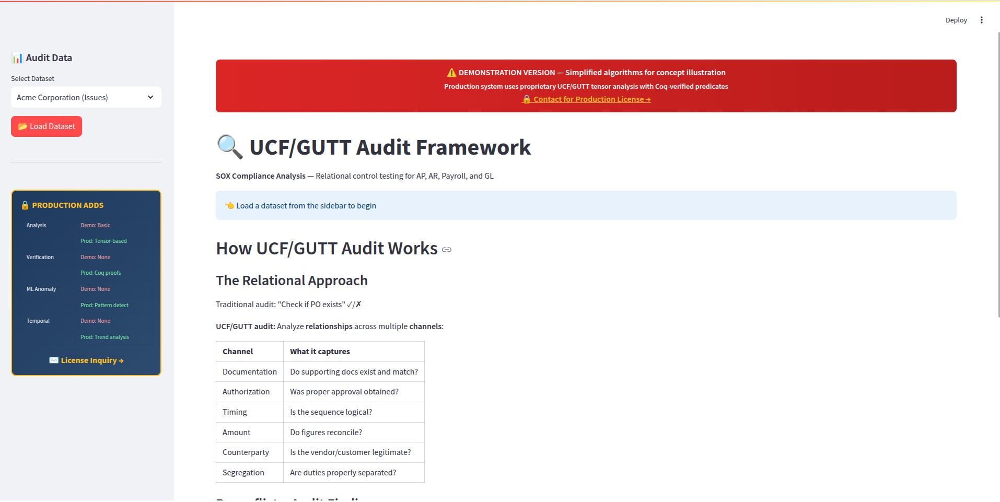
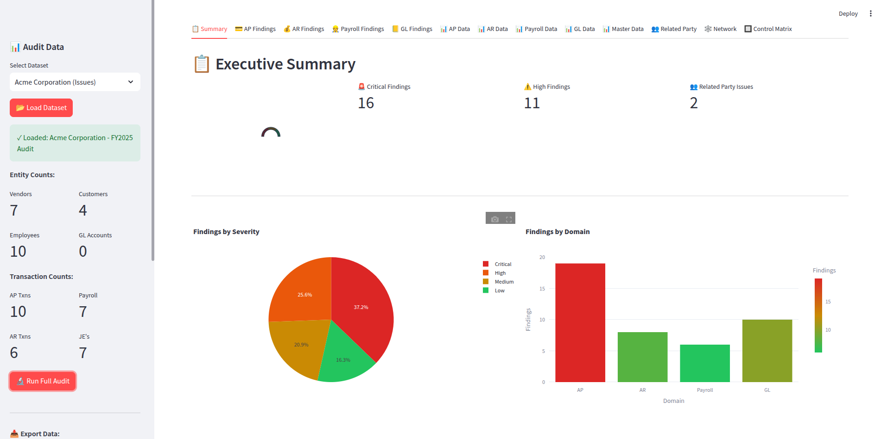
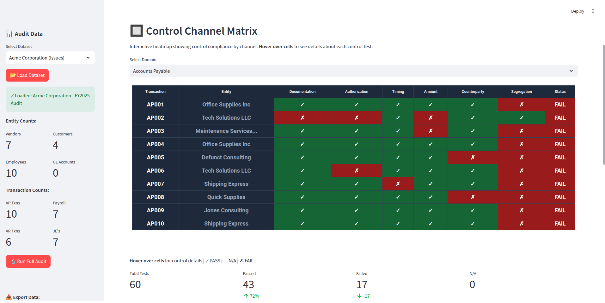
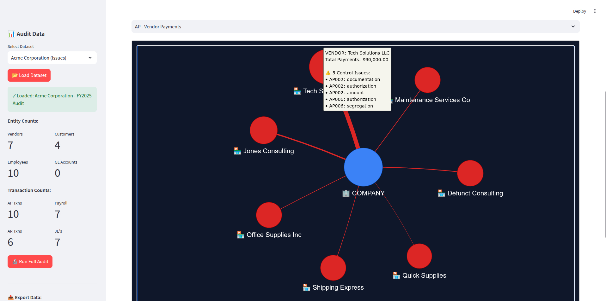
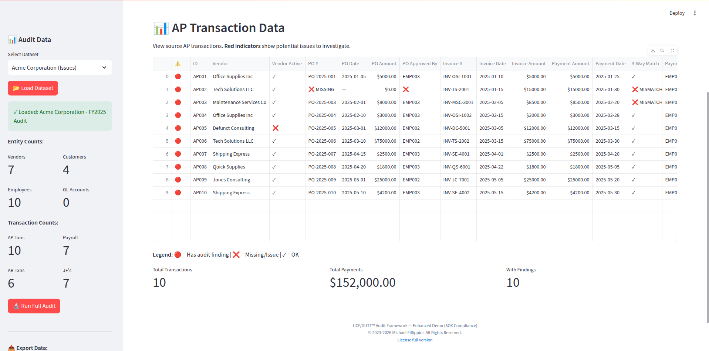

# UCF/GUTT Financial Audit Framework

### Relational Tensor-Based Audit Analytics

[](https://www.python.org/downloads/)
[](https://streamlit.io/)
[](#license)

> **A paradigm shift in audit analytics**: Unlike rule-based systems or black-box AI, UCF/GUTT models financial transactions as relational tensors with multi-channel control weighting, providing gradated risk scores with full explainability.



---

## 🎯 What Makes This Different?

| Traditional Audit Tools | UCF/GUTT Approach |
|------------------------|-------------------|
| `IF amount > $10K THEN flag` | Weighted tensor across 5-7 control channels |
| Binary Pass/Fail | Gradated scores (-1.0 to +1.0 per channel) |
| Siloed domain checks | Unified relational model across AP/AR/Payroll/GL |
| Name/address matching | Graph-based structural pattern detection |
| Black-box anomaly scores | Traceable channel-by-channel explanations |

### Control Channel Architecture

Each transaction is evaluated across multiple control channels:

```
Transaction AP-001 (Vendor Payment)
├── documentation:  +1.0 ✓ (PO, invoice, receipt present)
├── authorization:  -1.0 ✗ (no approval signature)
├── timing:         +1.0 ✓ (correct sequence)
├── amount:         -1.0 ✗ (PO ≠ Invoice mismatch)
├── counterparty:   +1.0 ✓ (approved vendor)
└── segregation:    +1.0 ✓ (different preparer/approver)
────────────────────────────
Net Score: +2.0 / 6 channels = 0.33 (Weak Pass, 2 issues)
```

---

## 🖥️ Screenshots

### Executive Dashboard
Health score gauge, findings by severity, domain breakdown.



### Data Loaded View
Transaction preview with entity counts after loading audit data.


### Control Channel Matrix
Visual heatmap of control test results with hover details.



### Transaction Network
Interactive graph showing money flow and flagged transactions.



### Related Party Detection
Identifies employee-vendor relationships indicating potential conflicts.


### Raw Data Views
Full transaction details with audit indicators.



---

## 🚀 Quick Start

### Prerequisites
- Python 3.10+
- pip

### Installation

```bash
# Clone the repository
git clone https://github.com/yourusername/ucf-audit-demo.git
cd ucf-audit-demo

# Install dependencies
pip install -r requirements.txt

# Optional: Install pyvis for interactive network graphs
pip install pyvis

# Run the demo
streamlit run app.py
```

### Requirements
```
streamlit>=1.28.0
pandas>=2.0.0
plotly>=5.18.0
networkx>=3.0
openpyxl>=3.1.0
pyvis>=0.3.0  # optional
```

---

## 📊 Features

### Audit Domains
- **Accounts Payable (AP)**: 3-way match, vendor validation, approval workflows
- **Accounts Receivable (AR)**: Aging analysis, credit limits, write-off controls
- **Payroll**: Ghost employee detection, timesheet validation, rate verification
- **General Ledger (GL)**: Journal entry testing, segregation of duties, balance validation

### Detection Capabilities
- ⚠️ Missing purchase orders
- ⚠️ 3-way match failures (PO ≠ Invoice ≠ Payment)
- ⚠️ Unauthorized transactions
- ⚠️ Self-approved journal entries
- ⚠️ Ghost employees (paid but don't exist)
- ⚠️ Terminated employee payments
- ⚠️ Related party transactions
- ⚠️ Round-dollar suspicious amounts
- ⚠️ Exceeded credit limits
- ⚠️ Segregation of duties violations

### Visualizations
- 📊 Health Score Gauge (0-100)
- 📊 Findings by Severity (pie chart)
- 📊 Domain Breakdown (bar chart)
- 🕸️ Transaction Network Graph (interactive)
- 🔲 Control Channel Heatmap
- 📋 Related Party Connection Table

### Data Export
- 📥 Excel workbook (all data, multiple sheets)
- 📥 CSV (audit findings)

---

## 🏗️ Architecture

```
┌─────────────────────────────────────────────────────────────┐
│                    UCF/GUTT Audit Universe                  │
├─────────────────────────────────────────────────────────────┤
│  Entities          │  Transactions       │  Tensors         │
│  ├── Vendors       │  ├── AP (payments)  │  ├── AP Tensor   │
│  ├── Customers     │  ├── AR (invoices)  │  ├── AR Tensor   │
│  └── Employees     │  ├── Payroll        │  ├── Payroll T.  │
│                    │  └── GL (journals)  │  └── GL Tensor   │
├─────────────────────────────────────────────────────────────┤
│                    Control Channels                         │
│  documentation | authorization | timing | amount |          │
│  counterparty | segregation | balance | employee            │
├─────────────────────────────────────────────────────────────┤
│                    Analysis Engine                          │
│  ├── Channel weight calculation                             │
│  ├── Finding generation                                     │
│  ├── Health score aggregation                               │
│  └── Related party detection                                │
└─────────────────────────────────────────────────────────────┘
```

---

## 📁 Project Structure

```
ucf_audit_demo/
├── app.py                 # Streamlit UI (main application)
├── audit_core.py          # Core data models and tensor structures
├── audit_analysis.py      # Analysis engine and finding generation
├── sample_audit_data.py   # Demo data generators
├── requirements.txt       # Python dependencies
├── README.md              # This file
├── INVESTOR_BRIEF.md      # Investment opportunity overview
└── screenshots/           # Application screenshots
    ├── dashboard.jpg
    ├── summary.jpg
    ├── data_loaded.jpg
    ├── control_matrix.jpg
    ├── network.jpg
    ├── related_party.jpg
    └── ap_data.jpg
```

---

## 🔬 The Science Behind It

UCF/GUTT (Universal Connectivity Framework / Grand Unified Tensor Theory) is a mathematical framework where **relations are ontologically primary** - entities emerge from relational patterns rather than relations connecting pre-existing entities.

### Why This Matters for Audit

Traditional audit software treats transactions as isolated records checked against rules. UCF/GUTT treats the entire audit universe as a **connected relational structure** where:

1. **Transactions are tensors** with multiple dimensions (source, target, channels, time)
2. **Controls are channel weights** that can be aggregated and compared
3. **Fraud patterns are structural** - detectable through graph analysis, not just field matching
4. **Everything is explainable** - every score traces back to specific channel evaluations

### Mathematical Foundation

The framework has been formally verified in **Coq proof assistant** with 100,000+ lines of machine-checked proofs, ensuring mathematical soundness. The same relational tensor structures are used in:

- Theoretical physics (quantum mechanics, general relativity recovery)
- Materials science (rare-earth-free magnet design)
- Geopolitical forecasting
- Organizational network analysis

---

## ⚠️ Demo Limitations

This is a **demonstration version** with:

- Sample data only (no ERP integration)
- ~20 transactions per domain
- Single-user interface
- No persistent storage

**Production version** would include:
- ERP connectors (SAP, Oracle, NetSuite, etc.)
- Million+ transaction scale
- Multi-user workflow
- Machine learning pattern discovery
- Audit committee reporting

---

## 📄 License

**Proprietary** - This demo is provided for evaluation purposes only. The UCF/GUTT relational tensor algorithms and analysis engine are proprietary technology.

For licensing inquiries, partnership opportunities, or investment discussions:

📧 **Michael_Fill@ProtonMail.com**  
🌐 **[relationalexistence.com](https://relationalexistence.com)**

---

## 🤝 Investment & Partnership

See [INVESTOR_BRIEF.md](INVESTOR_BRIEF.md) for:
- Market opportunity ($3.2B+ audit software market)
- Competitive differentiation
- Partnership models
- Contact information

---

<p align="center">
  <b>UCF/GUTT</b> — Relational Intelligence for Financial Audit<br>
  <i>Making the invisible visible through relational mathematics</i>
</p>
